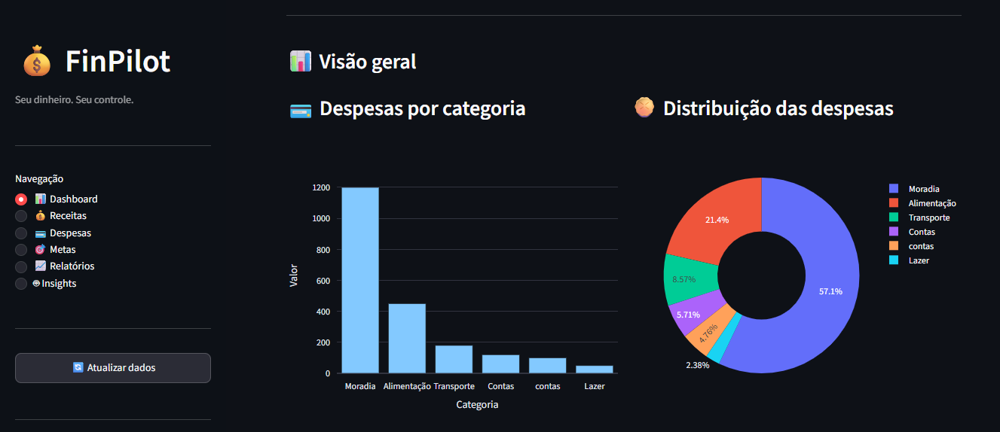
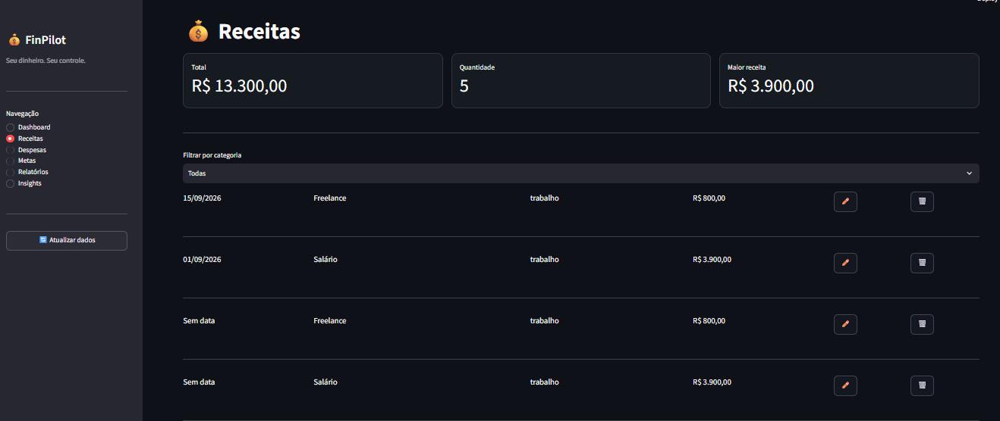
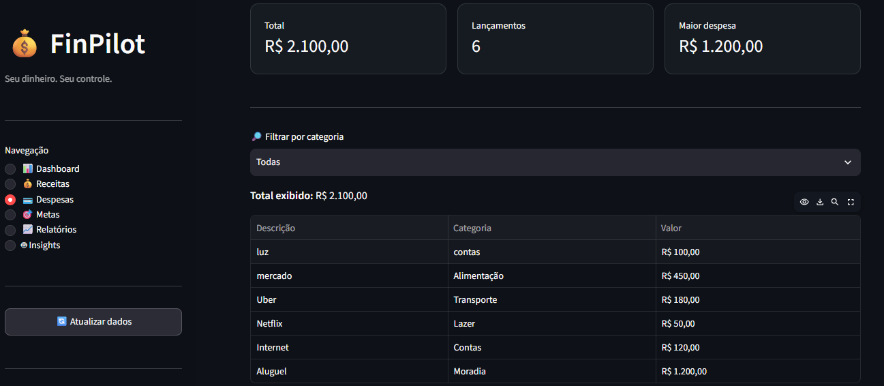
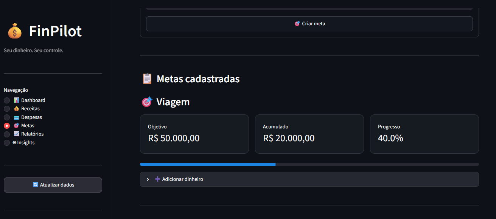
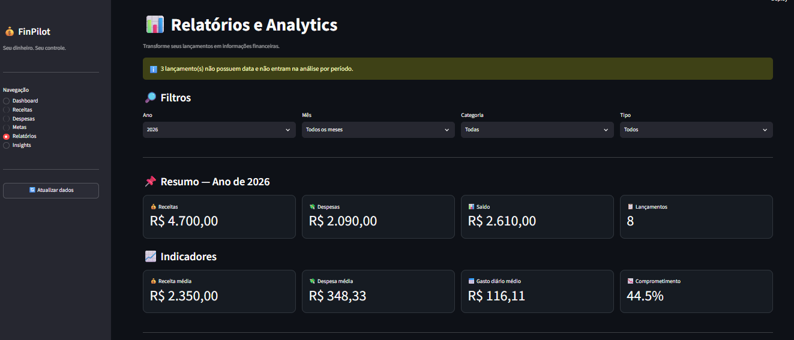
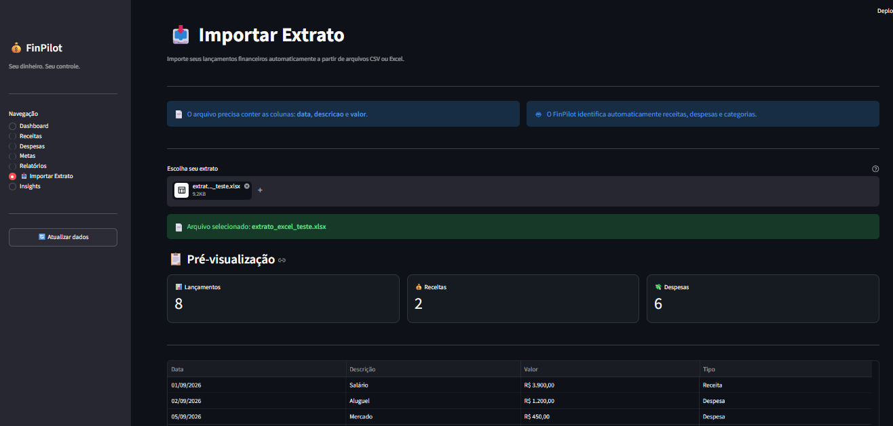
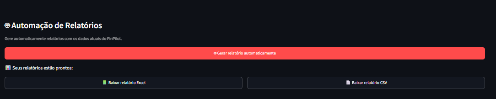

# 💰 FinPilot

### Seu dinheiro. Seu controle.

O **FinPilot** é um sistema de controle financeiro pessoal desenvolvido em Python, com foco em organização financeira, análise de dados, automação e futura integração com Inteligência Artificial.

O projeto começou como uma aplicação financeira executada pelo terminal e evoluiu para uma aplicação completa com banco de dados, dashboard interativo, análises, importação automática de extratos e geração de relatórios.

---

## 📸 Interface

### Dashboard



### Receitas



### Despesas



### Metas



### Relatórios



### Importação de Extratos




### Automação de Relatórios



---

## 🚀 Funcionalidades

### 💵 Controle financeiro

* Cadastro de receitas
* Cadastro de despesas
* Categorias financeiras
* Histórico de lançamentos
* Cálculo de saldo
* Controle de metas financeiras
* Edição e exclusão de lançamentos

### 📊 Analytics

* Dashboard financeiro
* Indicadores financeiros
* Análise por categoria
* Evolução mensal
* Comparação entre períodos
* Estatísticas de receitas e despesas
* Gráficos interativos

### 📥 Automação de extratos

* Importação de arquivos CSV
* Importação de arquivos Excel
* Identificação automática de receitas e despesas
* Padronização de dados
* Detecção de lançamentos duplicados
* Atualização automática de categorias
* Categorização automática por regras

### 🤖 Automação de relatórios

* Geração automática de relatórios
* Exportação para Excel
* Exportação para CSV
* Resumo financeiro automático
* Análise de gastos por categoria
* Evolução mensal
* Separação entre receitas e despesas

---

## 🏗️ Arquitetura

```text
FinPilot
│
├── Interface
│   ├── Dashboard
│   ├── Receitas
│   ├── Despesas
│   ├── Metas
│   └── Relatórios
│
├── Core
│   ├── Cálculos financeiros
│   ├── Categorias
│   └── Regras de negócio
│
├── Dados
│   └── Banco de dados SQLite
│
├── Analytics
│   ├── Estatísticas
│   └── Gráficos
│
├── IA
│   ├── Análise de gastos
│   ├── Insights
│   └── Assistente financeiro
│
└── Automação
    ├── Importação de extratos
    └── Relatórios automáticos
```

---

## 🛠️ Tecnologias

* Python
* SQLite
* Pandas
* NumPy
* Matplotlib
* Plotly
* Streamlit
* Excel
* CSV
* Git
* GitHub

---

## ▶️ Como executar

Clone o repositório:

```bash
git clone https://github.com/ferpotye/python-ia-lab.git
```

Entre na pasta do projeto:

```bash
cd python-ia-lab/finpilot
```

Execute o Dashboard:

```bash
streamlit run dashboard.py
```

O Streamlit abrirá o FinPilot no navegador.

---

## 📊 Fluxo de utilização

```text
Extrato bancário
       ↓
Importação CSV/Excel
       ↓
Validação dos dados
       ↓
Identificação de receitas/despesas
       ↓
Categorização automática
       ↓
Banco de dados SQ   Lite
       ↓
Analytics
       ↓
Dashboard
       ↓
Relatórios automáticos
       ↓
Excel / CSV
```

---

## 🧠 Evolução do projeto

### V1 — Controle financeiro

✅ Controle de receitas e despesas
✅ Categorias
✅ Metas
✅ Histórico
✅ Análise financeira baseada em regras

### V2 — Banco de dados e Analytics

✅ SQLite
✅ Pandas
✅ Dashboard com Streamlit
✅ Gráficos interativos
✅ Filtros
✅ Relatórios
✅ Exportação CSV/Excel

### V3 — Automação

✅ Importação de extratos
✅ Processamento automático
✅ Detecção de duplicidades
✅ Categorização automática
✅ Geração automática de relatórios
✅ Exportação automática para Excel e CSV
✅ Integração da automação ao Dashboard

### V4 — Inteligência Artificial

🔜 Insights financeiros utilizando IA
🔜 Análise inteligente dos gastos
🔜 Recomendações personalizadas
🔜 Assistente financeiro conversacional

### Futuro — Agentes de IA

🔜 Agente financeiro autônomo
🔜 Automação de tarefas
🔜 Análise contínua das finanças
🔜 Geração inteligente de relatórios
🔜 Integração com outras fontes de dados

---

## 🎯 Objetivo

O objetivo do FinPilot é evoluir de uma aplicação tradicional de controle financeiro para uma solução inteligente capaz de **analisar dados, identificar padrões, gerar insights e automatizar tarefas financeiras**.

O projeto também faz parte do meu processo de desenvolvimento de habilidades em:

* Python
* Análise de dados
* Automação
* Inteligência Artificial
* Desenvolvimento de aplicações
* Construção de soluções reais

---

## 👩‍💻 Autora

**Fernanda Potye**

Projeto desenvolvido como parte da minha jornada de aprendizado em Python, Inteligência Artificial, Analytics e Automação.
