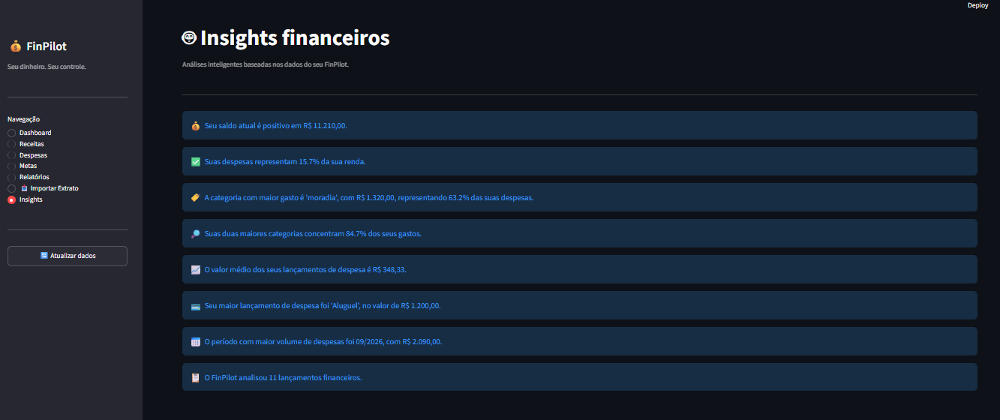
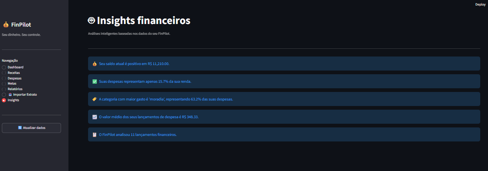
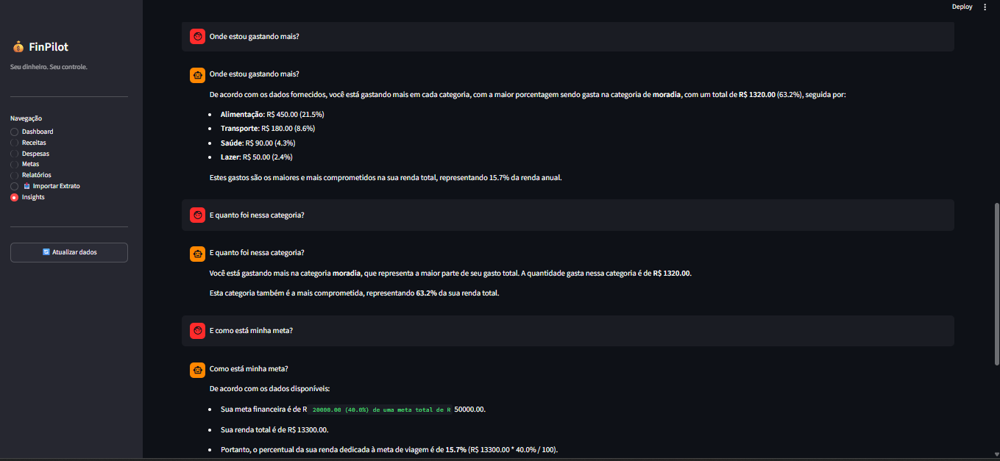

# 💰 FinPilot

### Seu dinheiro. Seu controle.

O **FinPilot** é um sistema de gestão financeira pessoal desenvolvido em Python, criado para transformar dados financeiros em informações úteis para análise e tomada de decisão.

O projeto evoluiu de um simples controle financeiro para uma aplicação completa com **dashboard interativo, análise de dados, automação de relatórios e Inteligência Artificial generativa local**.

> 🚀 **Projeto de portfólio em evolução contínua, com foco em Python, Dados, IA e Automação.**

---

## ✨ Visão geral

O FinPilot permite centralizar informações financeiras, acompanhar receitas e despesas, definir metas, importar extratos e analisar o comportamento financeiro por meio de um dashboard interativo.

A partir da versão 4, o projeto passou a incorporar **IA generativa local**, permitindo que o usuário converse com o sistema sobre seus próprios dados financeiros.

### Atualmente o FinPilot possui

* 💰 Controle de receitas
* 💸 Controle de despesas
* 🎯 Metas financeiras
* 📊 Dashboard interativo
* 📈 Análise de dados financeiros
* 🧠 Insights automáticos
* 🤖 Assistente de IA generativa local
* 💬 Conversação com histórico
* 📥 Importação de arquivos CSV e Excel
* 📄 Geração de relatórios
* ⚙️ Automação de relatórios
* 🗄️ Banco de dados SQLite
* 🔎 Análise por categorias
* 📊 Indicadores financeiros
* 💡 Recomendações baseadas nos dados fornecidos ao modelo

---

# 🤖 Inteligência Artificial

Uma das principais evoluções do FinPilot foi a integração de **IA generativa local**, sem depender inicialmente de APIs pagas.

A aplicação utiliza:

* **Ollama**
* **Qwen 2.5 3B**
* Python
* Contexto financeiro estruturado
* Histórico de conversação

A IA recebe informações financeiras calculadas pelo próprio sistema e pode responder perguntas relacionadas ao comportamento financeiro.

### Exemplos de perguntas

```text
Onde estou gastando mais?

Quanto eu gastei com alimentação?

Consigo guardar dinheiro este mês?

Quais despesas estão pesando mais no meu orçamento?

Como posso reduzir meus gastos?

Como estão minhas metas financeiras?
```

### 💬 Memória conversacional

A partir da **V4.5**, o FinPilot passou a manter o histórico da conversa durante a sessão, permitindo perguntas de continuidade.

Exemplo:

```text
Usuário:
Onde estou gastando mais?

FinPilot:
Sua maior categoria de despesas é Alimentação.

Usuário:
E quanto foi nessa categoria?

FinPilot:
Você gastou R$ X em Alimentação.
```

A camada de IA foi organizada separadamente do dashboard, mantendo a lógica de geração de contexto e prompts dentro do módulo:

```text
ia/
└── ia_generativa.py
```

---

# 🧠 Arquitetura

O projeto foi estruturado de forma modular para separar interface, banco de dados, análise, relatórios, automação e inteligência artificial.

```text
FinPilot
│
├── dashboard.py
│   └── Interface principal em Streamlit
│
├── database.py
│   └── Banco de dados SQLite
│
├── importador.py
│   └── Importação e processamento de CSV/Excel
│
├── analytics.py
│   └── Análises financeiras
│
├── charts.py
│   └── Visualizações
│
├── relatorios.py
│   └── Geração de relatórios
│
├── automacao_relatorios.py
│   └── Automação de relatórios
│
├── ia/
│   ├── __init__.py
│   ├── ia_generativa.py
│   │   └── IA generativa local
│   │
│   └── insights.py
│       └── Insights financeiros
│
├── screenshots/
│   └── Evidências visuais do projeto
│
├── requirements.txt
│   └── Dependências do projeto
│
└── README.md
    └── Documentação
```

> 🗄️ O banco `finpilot.db` é criado/utilizado localmente e está protegido pelo `.gitignore`. Ele não faz parte do repositório público.

---

# 🛠️ Tecnologias

| Tecnologia     | Utilização                      |
| -------------- | ------------------------------- |
| 🐍 Python      | Desenvolvimento principal       |
| 🎨 Streamlit   | Interface web                   |
| 🗄️ SQLite     | Banco de dados                  |
| 🐼 Pandas      | Manipulação e análise de dados  |
| 🔢 NumPy       | Operações numéricas             |
| 📊 Plotly      | Visualizações interativas       |
| 📈 Matplotlib  | Gráficos                        |
| 📄 OpenPyXL    | Processamento de arquivos Excel |
| 📋 CSV         | Importação de dados             |
| 🤖 Ollama      | Execução local de modelos       |
| 🧠 Qwen 2.5 3B | Modelo de IA generativa         |
| 🔧 Git         | Controle de versão              |
| 🐙 GitHub      | Versionamento e portfólio       |

---

# 📊 Dashboard

O dashboard concentra as principais informações financeiras em uma única interface.

Entre os principais indicadores estão:

* 💰 Total de receitas
* 💸 Total de despesas
* 💵 Saldo
* 📊 Percentual da renda comprometida
* 🏷️ Distribuição das despesas por categoria
* 📈 Evolução financeira
* 💳 Maiores despesas
* 🎯 Metas financeiras
* 🧠 Insights financeiros

### Dashboard


---

# 💳 Controle financeiro

O FinPilot permite registrar e administrar receitas e despesas.

### Receitas

Cada lançamento pode conter:

* Descrição
* Categoria
* Valor
* Data

### Despesas

Cada lançamento pode conter:

* Descrição
* Categoria
* Valor
* Data

Os lançamentos são armazenados no banco SQLite e utilizados posteriormente nas análises, gráficos, relatórios e contexto fornecido à IA.

### Despesas


### Receitas


---

# 🎯 Metas financeiras

O sistema permite criar e acompanhar metas financeiras.

Cada meta pode possuir:

* Nome
* Valor objetivo
* Valor acumulado
* Progresso
* Status

Isso permite acompanhar visualmente a evolução de cada objetivo.


---

# 📥 Importação de extratos

O FinPilot possui suporte para importação de dados financeiros através de:

* CSV
* Excel / XLSX

### Fluxo

```text
Extrato bancário
       ↓
Importação
       ↓
Processamento
       ↓
Classificação
       ↓
Banco SQLite
       ↓
Analytics
       ↓
Dashboard
       ↓
Relatórios
       ↓
IA
```


---

# 📈 Análise e Insights

O FinPilot possui uma camada de análise financeira responsável por transformar os dados registrados em informações úteis.

Entre as análises realizadas estão:

* Distribuição das despesas
* Principais categorias
* Maiores gastos
* Indicadores financeiros
* Evolução das receitas e despesas
* Situação das metas
* Insights automáticos

### Análise inteligente



### Insights financeiros



---

# 📄 Relatórios

O sistema possui geração de relatórios financeiros a partir dos dados armazenados.

Os relatórios podem ser utilizados para acompanhar:

* Receitas
* Despesas
* Categorias
* Saldo
* Evolução financeira
* Indicadores

O projeto também possui uma camada específica para automação de relatórios.

### Relatórios


### Automação de relatórios


---

# 🤖 Assistente de IA

O Assistente de IA permite consultar os dados financeiros utilizando linguagem natural.

A aplicação constrói um contexto financeiro estruturado antes de enviar a pergunta ao modelo local.

O contexto pode incluir:

* Receitas
* Despesas
* Saldo
* Percentual comprometido
* Categorias de despesas
* Maiores gastos
* Metas financeiras
* Histórico da conversa

O modelo recebe instruções para utilizar somente os dados fornecidos pela aplicação e evitar a criação de valores que não estejam presentes no contexto.



---

# 🧩 Organização do projeto

A arquitetura busca manter cada responsabilidade em seu próprio módulo.

```text
Interface
   ↓
Dashboard
   ↓
Regras de negócio
   ↓
Banco de dados
   ↓
Analytics
   ↓
Relatórios
   ↓
Insights
   ↓
IA Generativa
```

Essa separação facilita a manutenção do projeto e permite adicionar novas funcionalidades sem concentrar toda a lógica em um único arquivo.

---

# 🚀 Como executar

## 1. Clone o projeto

```bash
git clone https://github.com/ferpotye/python-ia-lab.git
```

## 2. Entre na pasta do FinPilot

```bash
cd python-ia-lab/finpilot
```

## 3. Instale as dependências

```bash
pip install -r requirements.txt
```

## 4. Instale o Ollama

O FinPilot utiliza o **Ollama** para executar o modelo de IA localmente.

Depois de instalar o Ollama, baixe o modelo utilizado pelo projeto:

```bash
ollama pull qwen2.5:3b
```

## 5. Execute o dashboard

```bash
streamlit run dashboard.py
```

Depois, abra no navegador o endereço apresentado pelo Streamlit.

---

# 🖼️ Screenshots

Algumas telas do FinPilot:

### Dashboard


### Assistente de IA


### Metas


### Relatórios


---

# 📈 Evolução do projeto

O FinPilot foi desenvolvido de forma incremental.

### V1 — Controle financeiro

* Cadastro de receitas
* Cadastro de despesas
* Controle financeiro básico

### V2 — Dados e Analytics

* Banco SQLite
* Estruturação dos dados
* Indicadores financeiros
* Análises

### V3 — Automação

* Importação de extratos
* Relatórios
* Automação de processos
* Dashboard interativo

### V4 — Inteligência Artificial

* Insights financeiros
* IA generativa local
* Ollama
* Qwen 2.5 3B
* Contexto financeiro
* Assistente conversacional

### V4.5 — Memória conversacional

* Histórico de conversa
* Perguntas de continuidade
* Contexto entre mensagens
* Interface de chat

### V4.6 — Organização da camada de IA

* Lógica conversacional centralizada
* Construção de contexto financeiro
* Histórico integrado ao prompt
* Separação entre dashboard e camada de IA
* Estrutura preparada para evolução futura

### V5.0 — Consolidação

Objetivos desta etapa:

* Organização final do projeto
* Documentação profissional
* Padronização das dependências
* Organização do GitHub
* Evidências visuais
* Preparação para evolução do FinPilot como projeto de portfólio

---

# 🔮 Próximos passos

O FinPilot foi projetado para continuar evoluindo.

Possíveis próximas etapas:

* 🤖 Transformar a IA em um agente financeiro mais autônomo
* 🧠 Melhorar a memória da IA
* 📊 Criar análises financeiras mais avançadas
* 🔄 Automatizar processos recorrentes
* 📥 Integrar novas fontes de dados
* 📄 Criar relatórios inteligentes
* 🔔 Criar alertas financeiros
* 🧩 Melhorar a arquitetura de agentes
* 🌐 Preparar uma versão para publicação
* ☁️ Avaliar infraestrutura para execução remota
* 🔐 Melhorar segurança e gerenciamento de dados

---

# 🔐 Dados e privacidade

O FinPilot foi desenvolvido inicialmente para execução local.

Isso significa que os dados financeiros utilizados durante o desenvolvimento permanecem no ambiente local da aplicação.

O projeto utiliza:

* SQLite para armazenamento local
* Ollama para execução local do modelo de IA

O banco de dados local e arquivos de teste são protegidos pelo `.gitignore` e não devem ser enviados ao repositório público.

> ⚠️ Para demonstrações públicas, recomenda-se utilizar dados fictícios ou anonimizados.

---

# 🎓 Objetivo do projeto

O FinPilot nasceu como um projeto prático para desenvolver e demonstrar conhecimentos em:

* Python
* Engenharia de software
* Banco de dados
* Análise de dados
* Automação
* Inteligência Artificial
* IA generativa
* Desenvolvimento de aplicações
* Git e GitHub

Mais do que uma aplicação financeira, o FinPilot representa uma jornada de evolução técnica: de um programa simples para controle financeiro até uma aplicação integrada com **dados + análise + automação + IA generativa**.

---

# 👩‍💻 Autora

**Fernanda Potye**

Projeto desenvolvido como parte da evolução prática em **Python, Inteligência Artificial, Dados e Automação**.

---

# ⭐ FinPilot

### Seu dinheiro. Seu controle. Seus dados. Sua IA.
